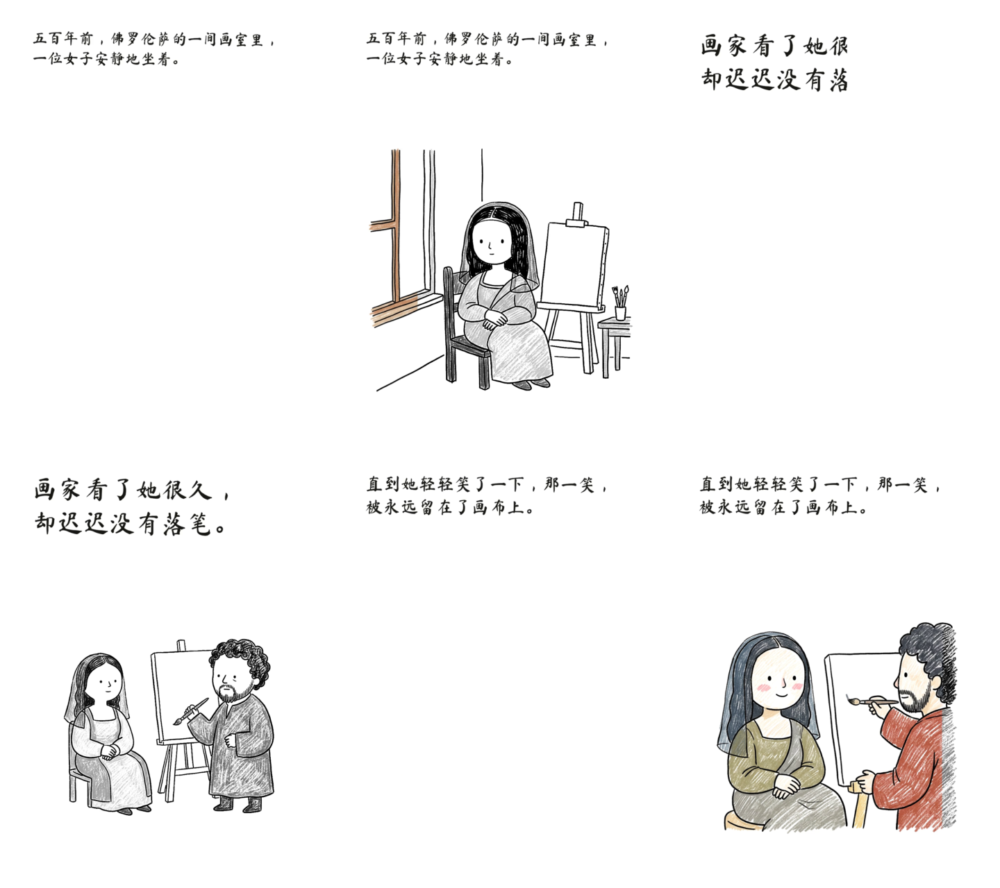

# monalisa-film · 手绘故事视频

把一段中文故事文案（或一组有序图片）做成 **3:4 竖屏的手绘故事动画**：
白纸底 → 手写中文字幕 → 从左到右显现黑色线稿 → 沿同一方向填入低饱和彩铅色。
输出 **静音 H.264** 画面轨，配音与 BGM 留给后期。

这是对 GitHub 上爆火的 Agent Skill 项目
[`gnipbao/story-to-handdrawn-video`](https://github.com/gnipbao/story-to-handdrawn-video)
（2.1k★，即 YouTube 视频 [《实测 Github 爆火的视频 skill》](https://www.youtube.com/watch?v=4zI2oP70aWs&t=19s)
里讲的「手绘故事视频」）的一次**从零复刻**：保留它全部渲染契约，把渲染后端从
Remotion/Chrome 换成不依赖浏览器的 Python + numpy + ffmpeg 实现——因为上游那套
需要下载 Chrome、系统图形库和 `storage.googleapis.com`，在很多服务器/沙箱里根本跑不起来。



## 先看效果

仓库里已经带着渲染好的成片（都用同一段示例故事《蒙娜丽莎的一笑》生成）：

| 文件 | 规格 | 说明 |
| --- | --- | --- |
| `renders/demo-cut-1080x1440.mp4` | 1080×1440 · 30fps · 15.0s | 正式成片，三层揭示（cut） |
| `renders/demo-cut-720x960.mp4` | 720×960 · 30fps · 15.0s | 快速预览 |
| `renders/demo-pageflip-1080x1440.mp4` | 1080×1440 · 30fps · 13.6s | 翻书转场版本 |

三条都**没有音轨**——这是设计如此，配音和 BGM 属于后期（见下文「怎么配音」）。

## 快速开始

```bash
git clone <this-repo> && cd monalisa-film
bash tools/bootstrap.sh          # 安装 numpy / Pillow / 静态 ffmpeg，并跑一遍自检
bash examples/build-demo.sh      # 用仓库自带的示例母图跑通全链路
```

`bootstrap.sh` 之后就可以完全离线使用了。

## 全流程

上游把 Agent 的工作和渲染器的工作分得很清楚，这里沿用同一套四段式流程：

```
故事文案
   │
   ├─ ① plan      分句 → 分镜 → 每幕时长 → 出图清单（generation-jobs.json）
   │
   ├─ ② generate  按清单用生图工具出「母图」= 每幕一张完整插画
   │              （Agent 调用生图工具，或直接投喂已有图片）
   │
   ├─ ③ import    导入母图 → 本地派生素材：彩色板 / 线稿板 / 字幕层
   │
   └─ ④ render    逐帧合成 → ffmpeg 编码 → 静音 H.264
```

```bash
# ① 规划（离线，不生成图片）
python3 scripts/run_story_video.py \
  --input examples/story-monalisa.txt \
  --title "蒙娜丽莎的一笑" \
  --style colored-pencil-diary \
  --mode plan

# ② 出图：编辑 .story-video/generation-jobs.json，把每幕母图生成到 output_master 路径
#    这一步有意留给 Agent / 生图工具——脚本不会假装自己能画画

# ③ 导入 + 派生图层
python3 scripts/run_story_video.py --mode import

# ④ 渲染
python3 scripts/run_story_video.py --mode preview    # → renders/picture_silent-preview.mp4 (720×960)
python3 scripts/run_story_video.py --mode render     # → renders/picture_silent.mp4        (1080×1440)
```

已经有整页图片、只想加动效的，跳过 ①②③：

```bash
python3 scripts/run_story_video.py --images 页1.png 页2.png 页3.png \
  --title "我的故事" --mode render --transition cut
```

## 命令行参数

| 参数 | 取值 | 说明 |
| --- | --- | --- |
| `--input` / `--text` / `--images` | 路径 / 字符串 / 多图 | 三选一的输入来源 |
| `--title` | 字符串 | 成片标题，用于批次目录命名 |
| `--style` | id / 编号 / 中文名 / 别名 | 画风，默认 `colored-pencil-diary` |
| `--palette` | `C-01`…`C-30` | 主题配色覆盖（不改画材，只换色系） |
| `--mode` | `plan`\|`generate`\|`import`\|`preview`\|`render`\|`full` | 流程阶段 |
| `--text-mode` | `font`（默认）\| `image2` | 字幕由本地面板渲染，还是用母图里的手写字 |
| `--layout` | `auto`\|`composite`\|`full` | 母图是「字幕+插画合成页」「只有插画」还是整页 |
| `--transition` | `cut`\|`page-flip` | 三层揭示 / 右下角卷页翻书 |
| `--transition-sec` | 秒 | 翻书时长，默认 0.7 |
| `--page-duration` | 秒 | `--images` 模式下每页时长，默认 4.4 |
| `--split-y` | `SCENE:PIXELS` | 手动指定某幕字幕/插画分界，可重复 |
| `--character-lock` | 字符串 | 角色一致性设定，写进出图提示词 |
| `--enable-detail` | 开关 | 启用 detail 图层（quality 模式，四层揭示） |
| `--wobble` | 数值 | >0 时给揭示边缘加手绘抖动（**非上游行为**，默认关闭） |
| `--list-styles` | 开关 | 列出画风目录（`--all-styles` 列全部 297 条） |
| `--selftest` | 开关 | 跑离线自检 |

## 画面是怎么来的

### 三层揭示（`--transition cut`，默认）

每幕的素材在**导入时**本地派生，生图模型只负责画一次彩色母图：

```
字幕层  ── 0%   开始写，22% 写完
线稿板  ── 18%  开始画，40% 画完     ← 由彩色板本地灰度化派生，像素完全对齐
彩色板  ── 52%  开始上色，36% 上完
```

三层都是同一个方向（`clip-path: inset(0 N% 0 0)` 的竖直边缘，从左到右），
所以换层时构图不会跳。线稿是由彩色图就地派生的
（`format=gray → eq=contrast=1.18:brightness=0.035 → unsharp=5:5:0.55`），
不额外调用生图模型——这也是上游省钱的关键设计。

### 翻书转场（`--transition page-flip`）

保留完整未裁切的母图，右下角卷起，卷起的背面是**本页褪色的影子**，
底下露出**下一页**。相邻页有重叠，所以总时长要减去重叠帧数。

### 画布与排版（契约）

| 项 | 值 |
| --- | --- |
| 正式输出 | 1080×1440 · 30fps · 白底 · 静音 H.264 |
| 预览输出 | 720×960（同比例同时序，等比缩小） |
| 字幕框 | top 86 / left 96 / 宽 888 / 高 288（设计坐标系） |
| 插画框 | left 74 / right 74 / top 382 / bottom 42 |
| 图层 z-index | 线稿 10 · detail 20 · 彩色 30 · 字幕 40 |
| 字号 | 由文案长度推算，夹在 48–82px |
| 图片适配 | 一律 `object-fit: contain`，**永不裁剪** |

这些数字不是拍脑袋定的，是逐条从上游 `src/Scene.tsx`、`src/LayerWipe.tsx`、
`src/TextWipe.tsx`、`src/StoryVideo.tsx`、`src/storyboard.ts` 和 `DESIGN.md` 抄过来的，
集中放在 [`scripts/handdrawn/contract.py`](scripts/handdrawn/contract.py) 里。

## 画风库

`references/handdrawn-style-library.json` 是 **327 项资产 = 297 条画风配方 + 30 套主题配色**，
另有 30 条精选菜单：

```bash
python3 scripts/run_story_video.py --list-styles                    # 精选 30 条
python3 scripts/run_story_video.py --list-styles --all-styles       # 全部 297 条
python3 scripts/run_story_video.py --list-styles --category ink     # 按分类
python3 scripts/run_story_video.py --list-styles --query 水墨        # 关键词
python3 scripts/run_story_video.py --list-styles --asset-type palette
```

`--style` 接受 id、编号、中文名或别名；`--palette C-01`…`C-30` 只换配色不改画材。
选中的配方会被写进 `generation-jobs.json` 的提示词里，作为出图时的画风锁定。

## 字幕：为什么默认是字体而不是让模型画字

上游默认让生图模型**把中文手写字画进母图**（`--text-mode image2`），
代价是模型经常写错笔画，必须人工逐字检查、错了就重新出图。

这个复刻默认走 **`--text-mode font`**：母图只出插画，字幕由本地字体渲染。
用的字体是随仓库分发的 OFL 开源毛笔脸 **MaShanZheng（马善政毛笔楷书）**，
每一笔都是真字形，永远不会写错字，也只有在这一层才能做到「确定性可复现」。
原始行为完整保留在 `--text-mode image2` 里。

## 怎么配音

成片是静音画面轨，两条路都能走：

**A. 用本工具生成配音**
时长已经按文案长度定在 4.4–6.2 秒/幕，直接按幕录或合成语音，再和画面拼起来：

```bash
ffmpeg -i renders/demo-cut-1080x1440.mp4 -i narration.m4a \
  -c:v copy -c:a aac -shortest renders/final.mp4
```

**B. 丢进剪映 / Premiere / CapCut**
把 MP4 拖进时间线，逐幕对齐配音即可；白底手绘的风格本来就适合后期加留白和音效。

## 姊妹片：《物理学撕碎的意外》（9:16 手绘悬疑解说）

同一套仓库里还有一条 **noire 管线**（`scripts/noire/` + `scripts/run_noire_video.py`），
输出 1080×1920 竖屏、逐幕调色、带配音与字幕的抖音式悬疑解说。
示例成片用的是 `examples/douyin-physics/`：23 幕分镜、22 幕云希配音、
手绘母图全部入库，讲一场用抛体物理戳穿的"意外坠楼"。

```bash
python3 scripts/run_noire_video.py --mode plan     # 检查幕数/配音/缺图
python3 scripts/run_noire_video.py --mode render   # 出片（含音轨）
```

| 成片 | 规格 | 说明 |
| --- | --- | --- |
| `renders/noire.mp4` | 1080×1920 · 30fps · 123.1s · 23 幕 | 母版（CRF 22，含 AAC 音轨） |
| `renders/noire-web.mp4` | 同上 · ~10 Mbps | 发布版，faststart |
| `renders/noire-preview.mp4` | 540×960 | 快速预览 |

成片不入库（`renders/*` 已 gitignore），按上面命令可离线复现。
画面核验见 `docs/film-contact-sheet.png`（23 幕抽帧拼版）。

## 项目结构

```
├── scripts/
│   ├── run_story_video.py          统一 CLI（plan / generate / import / preview / render）
│   ├── run_noire_video.py          9:16 悬疑解说 CLI（plan / render / grades）
│   ├── handdrawn/
│       ├── contract.py             渲染契约：画布、排版、图层时序、翻书几何
│       ├── imaging.py              CSS filter 模拟、contain 适配、线稿派生
│       ├── caption.py              手写字幕渲染（真字形，OCR 级准确）
│       ├── layout.py               合成页的字幕/插画分界检测
│       ├── scene.py                单幕合成与三层揭示
│       ├── pageflip.py             右下角卷页几何与着色
│       ├── encoder.py              ffmpeg 发现与静音 H.264 编码
│       ├── render.py               整片调度
│       ├── story.py                分句、分镜、时长、出图清单
│       └── styles.py               327 项画风库的检索
├── references/
│   ├── handdrawn-style-library.json  画风库（上游原样分发）
│   ├── target-diary-style.txt        默认画风的提示词母本
│   └── sample-pages/                 示例母图（离线跑通全流程用）
├── assets/fonts/                   MaShanZheng-Regular.ttf (OFL)
├── examples/                       示例故事 + 一键复现脚本
├── tests/test_pipeline.py          离线自检：契约 / 分句 / 画风库 / 端到端
├── tools/bootstrap.sh              一键装环境
├── renders/                        成片输出
└── docs/contact-sheet.png          关键帧拼图
```

## 自检

```bash
python3 tests/test_pipeline.py     # 或 npm run check
```

会当场合成几张手绘母图，跑完 `plan → import → preview` 全链路，并断言：
画布是 3:4、cut 总帧数是 Σ时长、翻书按契约扣除重叠、预览确实是 720×960、
时长与契约一致。**不联网、不需要 API key。**

## 和上游的差异

| 项 | 上游 (Remotion) | 本复刻 (Python) |
| --- | --- | --- |
| 渲染后端 | Chrome + React + Remotion | numpy + Pillow + ffmpeg |
| 安装体积 | ~400MB+（含 Chrome 下载） | ~150MB（含静态 ffmpeg 二进制） |
| 无图形库/无外网的服务器 | 跑不起来 | 可以跑 |
| 渲染契约 | — | **逐条保留**（画布、排版、时序、翻书几何、编码参数） |
| 字幕默认 | `image2`（模型画字） | `font`（真字形），`image2` 仍保留 |
| 画风库 | 327 项 | 同左，原样分发 |
| 揭示边缘 | 严格竖直 | 竖直；`--wobble>0` 可选加抖动 |
| 合成页分界检测 | ffmpeg 取 256px 灰度 | Pillow 复刻同一算法 |
| 增量渲染 / Remotion Studio | 有 | 暂无 |

一句话：**契约照搬，技术栈换掉，画风库沿用。**

## 许可与署名

- 本仓库原创代码：[MIT](LICENSE)。
- `references/handdrawn-style-library.json` 及其衍生配方来自
  [`gnipbao/story-to-handdrawn-video`](https://github.com/gnipbao/story-to-handdrawn-video)，
  按其随附许可分发，详见 [`references/handdrawn-styles-LICENSE.txt`](references/handdrawn-styles-LICENSE.txt)。
- 字体 **MaShanZheng** by 马善政，SIL Open Font License 1.1，
  详见 [`assets/fonts/OFL-MaShanZheng.txt`](assets/fonts/OFL-MaShanZheng.txt)。
- 示例故事与示例母图为本项目原创/生成，可自由替换。

---

## English

**monalisa-film** turns a Chinese story script (or an ordered set of images) into a
**3:4 vertical hand-drawn story animation**: white page → handwritten Chinese
caption → black-and-white line art wiping in from the left → muted wax-crayon
colour following the same direction. Output is a **silent H.264** picture track;
voiceover and music are post-production.

It is a from-scratch reimplementation of the popular Agent Skill
[`gnipbao/story-to-handdrawn-video`](https://github.com/gnipbao/story-to-handdrawn-video)
— the "手绘故事视频" project reviewed in
[this YouTube video](https://www.youtube.com/watch?v=4zI2oP70aWs&t=19s). The
rendering **contract** is ported line by line (canvas, layout boxes, layer
timing, page-flip geometry, encoder settings); the rendering **stack** is not:
Remotion + Chrome is replaced with numpy + Pillow + ffmpeg, so it runs headless
on machines that cannot install a browser.

```bash
bash tools/bootstrap.sh                  # numpy, Pillow, static ffmpeg; then self-test
bash examples/build-demo.sh              # offline end-to-end demo
python3 scripts/run_story_video.py --input examples/story-monalisa.txt \
        --title "蒙娜丽莎的一笑" --mode plan      # -> plan + image-generation manifest
```

Two transition modes: `cut` (text → locally-derived line art → colour reveal) and
`page-flip` (untouched master page, bottom-right curl revealing the next page
underneath). 327 style assets (297 recipes + 30 palettes) ship with the repo;
captions use a real OFL brush font by default so Chinese glyphs are always
correct, with the upstream image-generated-lettering mode still available via
`--text-mode image2`. `python3 tests/test_pipeline.py` verifies the whole
contract offline with no API keys.
